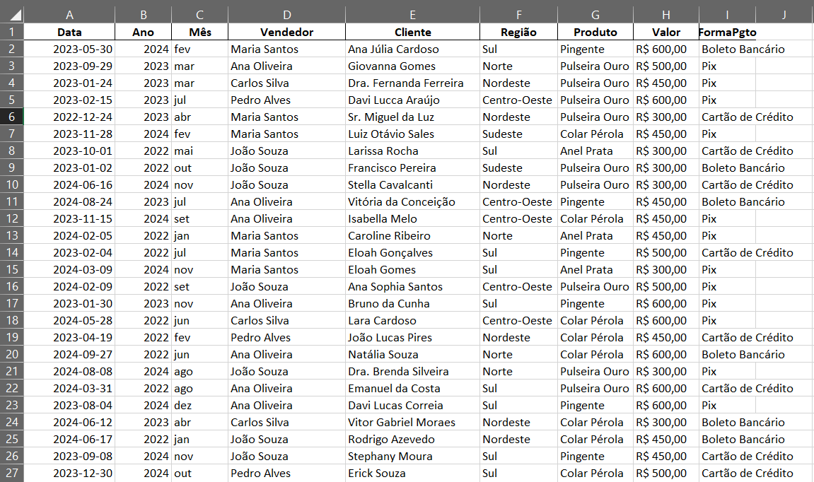
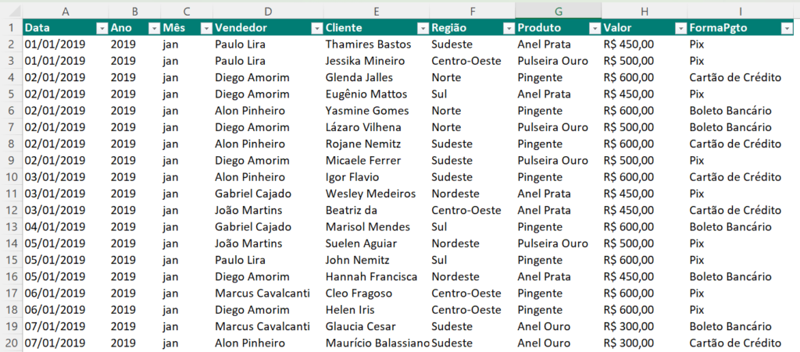

    <h6>Planilha Gerada pelo ChatGPT </h6> 

# Projeto Desafio Análise de Dados de Planilhas com I.A. Generativa

 > ℹ️ **NOTE:** Este é o repositório desenvolvido durante o curso no qual fui aluno na plataforma da [DIO](https://dio.me)

Projeto com o objetivo de trabalhar com planilhas com as ferramentas de IA Generativas, todos os Prompts seguem abaixo.

💻[Acessar a planilha controle de vendas exemplo gerado via ChatGPT](./outputs/controle-de-vendas-exemplo-gerado-GPT.xlsx) 

📥 <a href="./outputs/controle-de-vendas-exemplo-gerado-GPT.xlsx" title="Baixar a Planilha"> Clique aqui para baixar a planilha 
</a>  - Controle de vendas exemplo gerado via ChatGPT

## Objetivo
Criar e analisar dados de uma planilha inteligente com AI Generatives (com uso do ChatGPT, GPTExcel).

## Ferramentas

 

 

## Passo a Passo
<table>
  <thead>
    <tr align="left">
      <th>nº</th>
      <th>Etapas de Trabalho</th>
    </tr>
  </thead>
  <tbody align="left">
    <tr>
      <td>01</td>
      <td>Executar prompt de susgestão de titulo no ChatGPT</td>
    </tr>
    <tr>
      <td>02</td>
      <td>Executar prompt de criação de uma planilha no ChatGPT</td>
    </tr>
    <tr>
      <td>03</td>
      <td>Executar prompt de análise de dados da planilha</td>  
    </tr>
  </tbody>
</table>

## 💻 Tecnologias utilizadas no projeto

- [ChatGPT](https://chatgpt.com/) - Texto
- [Gptexcel](https://gptexcel.uk/) - Texto
- [Copilot](https://copilot.microsoft.com/) - Texto
- [Excel](https://www.microsoft.com/en/microsoft-365/excel)

## 🧠 Prompts

Copilot：

|   Ação   | Prompt                                                                     |
| :------: | ------------------------------------------------------------------------------------------------------------------------------------------------------------------------------------------------------------------------------------------------------------------------------ |
|  Planilha  |    Gere uma planilha como o exemplo acima, mas com outros dados e até 100 linhas.  |
| Relatório | A partir dessa planilha acima como base de conhecimento elabore um relatório e gere alguns insights de vendas. |

|  Ação  |     Prompt   |                                                
| :----: | -------------------------------------------------------------------------------------- | 
|  |  |

## ✨ Features

- Conteúdo 100% gerado via [ChatGPT](https://chatgpt.com/)

## 📚 Materiais

- Imagen utilizada em `inputs`
- Planilha gerada em `outputs`

## 🛠️ Instruções de execução

Utilize os prompts acima nas ferramentas IAS sugeridas para gerar o material base e utilize uma ferramenta de edição de documentos como Word, Notpad, Libreoffice.

⚠️
Repositório desenvolvido para fins didáticos, com a disponibilização da atividade prática para o lab da [Digital Innovation One](https://www.dio.me/).

 

## 👨‍💻 Autor

    
    
&nbsp&nbsp&nbsp Crédito a Weslley Dourado 
    &nbsp&nbsp&nbsp
    <a href="https://github.com/weslleydourado/">
    GitHub</a>&nbsp;|&nbsp;
    <a href="https://linkedin.com/in/weslleydourado">LinkedIn</a>
&nbsp;|&nbsp;
    <a href="https://instagram.com/weslley.dourado/">
    Instagram</a>
&nbsp;|&nbsp;

 &nbsp;
 &nbsp;
 &nbsp;

##

Elaborado por <a href="https://github.com/weslleydourado/">Weslley Dourado</a>.

 

